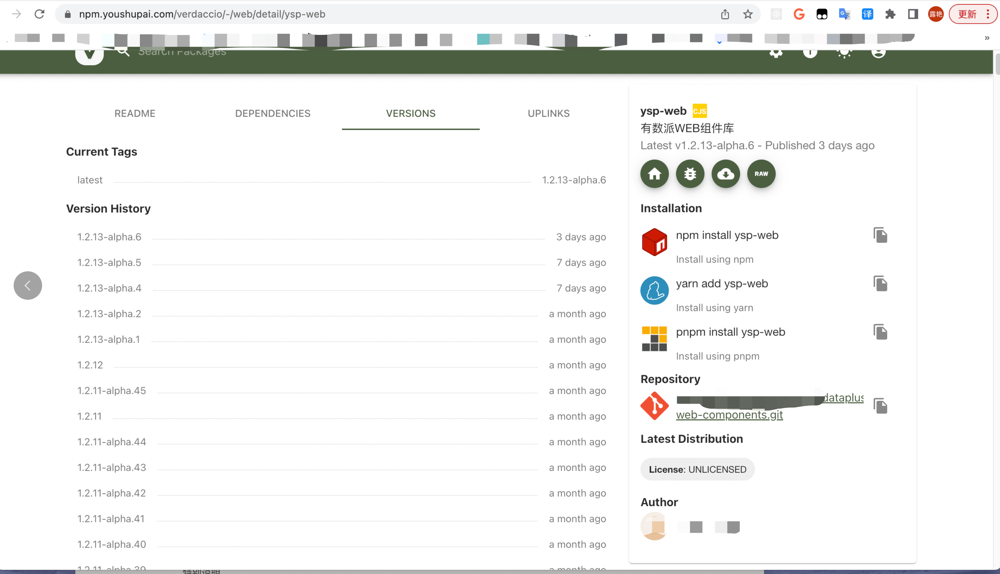
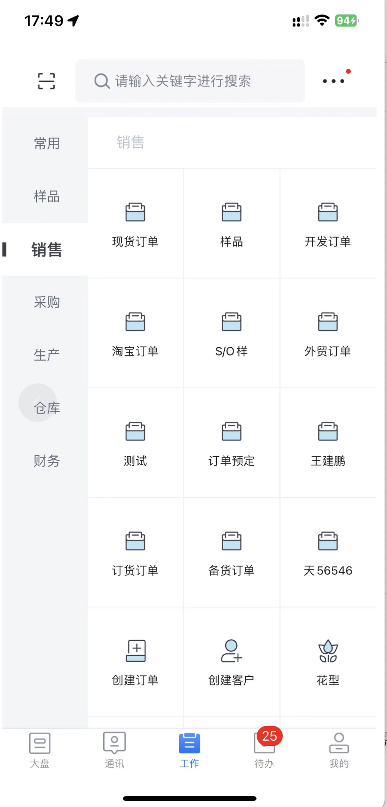

##### 有数派项目相关架构图

- 因**保密协议**原因，相关数据需要进行**脱敏**处理，**展示数据均为测试环境数据**

相关主SASS项目, 前端由web, app, ipad, 小程序，H5, 数据大屏，树莓派，Tv等组成的一整套解决方案。

以下为大概的系统图

- 主web 对应子应用 单个模块 效果图
  - 官网 https://www.youshupai.com
  - 主应用入口 https://pms.youshupai.com
  - 

- 应用市场&插件系统

- 实现了Table组件如Excel丝滑的编辑体验

- 一小部分商城功能 进行可拖拽的组件编辑功能 通过约定的schema来进行可视化编辑
  - 可以通过微信小程序搜索 **料易通小程序** 进行查看
  - 或者通过访问H5  https://shop-h5.youshupai.com 进行查看
  - 也可以通过应用市场搜索 **有数派** 进行查看 (但需要账号权限)

- 自研的灰度系统

  - 通过CI/CD + 灰度系统一整套 解决了晚上部署晚下班的问题

  

- 内部自搭的私服
  - ysp-web对应的版本发布情况

- 不干胶单据低代码平台

- App端 简单的页面展示

  - 有数派

  

  - 有数派pro
  - 